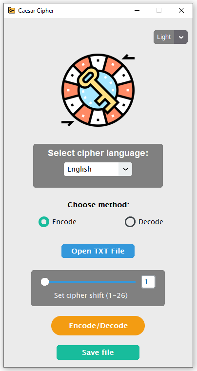
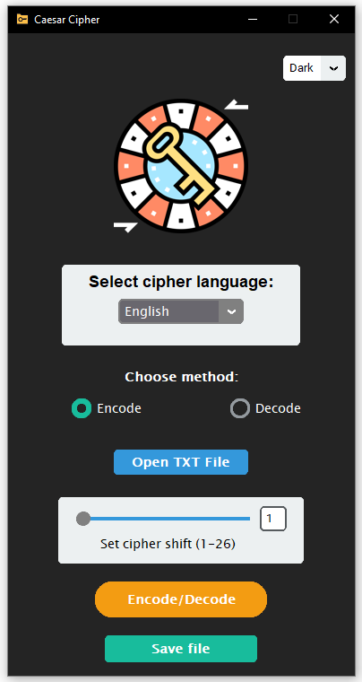

# Caesar Cipher program

Caesar Cipher is one of the widely known encryption techniques. 
This program helps you to encrypt or decrypt the messages.

Build with Python. Implemented with a GUI (made with the CustomTkinter).

 ||| 

## Features

- Select cipher language
- Choose options (encode / decode)
- Set cipher key depends on selected language
- Read user text from file
- Save the encrypted text in an individual file
- Buttons in the program appear/become available as you select options
- App realise with modern GUI (CustomTkinter)

## Fast using repo
You can set up project locally.
To get a local copy:
```sh
   git clone https://github.com/ArtemKhov/Caesar-Cipher-desktop-program
   ```
Make sure that your using `python3`

Don't forget to install packages:
```sh
   pip3 install -r requirements.txt
   ```
or
```sh
   pip install -r requirements.txt
   ```

## License

Each file included in this repository is licensed under the [MIT Licence](LICENSE.txt).